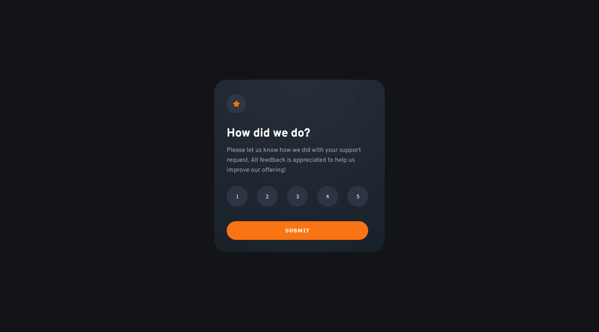

# Frontend Mentor - Interactive rating component solution

This is a solution to the [Interactive rating component challenge on Frontend Mentor](https://www.frontendmentor.io/challenges/interactive-rating-component-koxpeBUmI). Frontend Mentor challenges help you improve your coding skills by building realistic projects. 

## Table of contents

- [Overview](#overview)
  - [The challenge](#the-challenge)
  - [Screenshot](#screenshot)
  - [Links](#links)
- [My process](#my-process)
  - [Built with](#built-with)
  - [What I learned](#what-i-learned)
- [Author](#author)

**Note: Delete this note and update the table of contents based on what sections you keep.**

## Overview

### The challenge

Users should be able to:

- View the optimal layout for the app depending on their device's screen size
- See hover states for all interactive elements on the page
- Select and submit a number rating
- See the "Thank you" card state after submitting a rating

### Screenshot

### Links

- Solution URL: [Github](https://github.com/Absynthee/interactive-rating-component-main)
- Live Site URL: [Github Pages](https://absynthee.github.io/interactive-rating-component-main/)

## My process

### Built with

- Semantic HTML5 markup
- CSS custom properties
- Flexbox
- Javascript

### What I learned

This challenge was quite difficult and provoked me to learn more about how Javascript works and include various functions. The hardest part was getting the correct number to display properly on the thank you section. 

A couple of things I did differently from the brief - I slightly changed the colours to better match the design screenshot, as they were a bit off. I added the radial gradient on the ratings-container, although it's not perfect it does get quite close to matching the original. I also put a button on the second part of the page to let users go back and start again. This was helpful for testing and allowed me to expand my learning a bit more.

## Author

- Website - [Austin Spillman](https://www.austinspillman.com)
- Frontend Mentor - [@Absynthee](https://www.frontendmentor.io/profile/Absynthee)